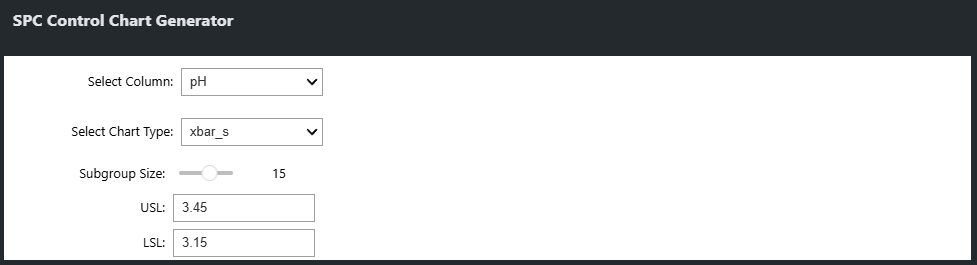
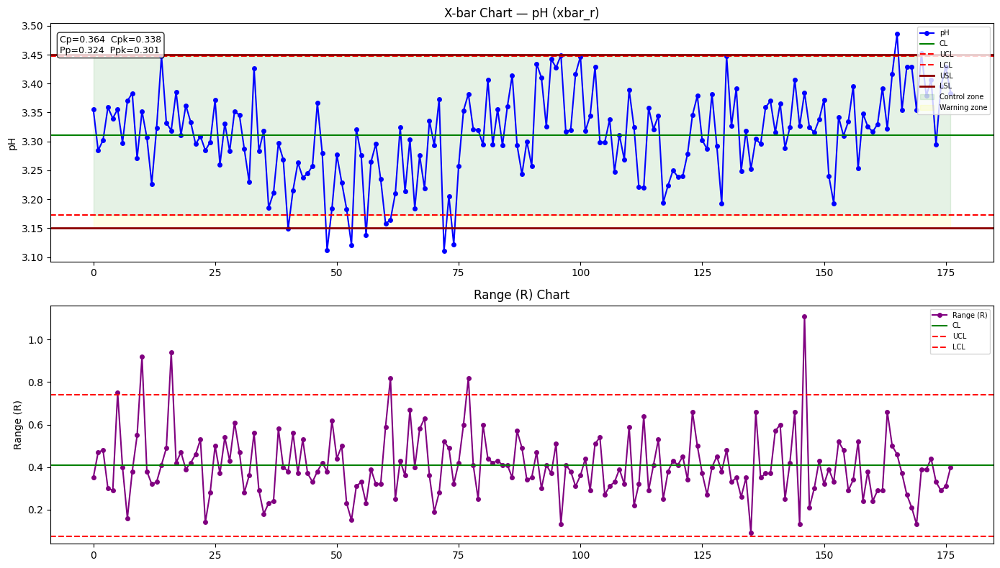
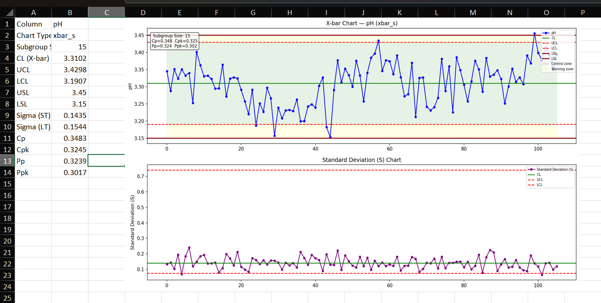

# SPC Control Chart Tool

A Jupyter notebook for generating Statistical Process Control (SPC) charts with process capability analysis. Supports X-bar/R, X-bar/S, and Individuals/Moving Range (I-MR) charts with Excel export.

---

## Run the Streamlit App

```bash
pip install -r requirements.txt
streamlit run app.py
```

Upload any CSV with numeric columns. The app auto-selects the chart type based on subgroup size and generates a downloadable Excel report.

### Deploy free on Streamlit Cloud

1. Push this repo to GitHub (already done)
2. Go to [share.streamlit.io](https://share.streamlit.io)
3. Connect your GitHub account and select this repo
4. Set **Main file path** to `app.py`
5. Click Deploy — anyone with the link can use it instantly, no install required

---

## Features

- **Three chart types** — automatically suggested based on subgroup size
- **Interactive controls** — dropdowns and sliders to configure the analysis without editing code
- **Process capability metrics** — Cp, Cpk, Pp, Ppk calculated and displayed on the chart
- **Control limit zones** — green (in-control), yellow (warning) shading on X-bar chart
- **Excel export** — outputs a formatted `.xlsx` file with the chart embedded and a stats summary

---

## Chart Types

| Chart | When it's used | Auto-selected when |
|---|---|---|
| X-bar / R | Subgroup means + ranges | n = 2–8 |
| X-bar / S | Subgroup means + std deviation | n ≥ 9 |
| I-MR | Individual measurements + moving range | Manual selection only (n = 1 data) |


---

## Requirements

```bash
pip install pandas numpy matplotlib ipywidgets openpyxl
```

| Package | Purpose |
|---|---|
| `pandas` | Data loading and manipulation |
| `numpy` | Subgroup calculations, control limits |
| `matplotlib` | Chart rendering |
| `ipywidgets` | Interactive parameter controls |
| `openpyxl` | Excel file export |

---

## Usage

1. **Open** `spc_tool.ipynb` in Jupyter
2. **Update the file path** in Cell 1 to point to your dataset (CSV with `;` delimiter)
3. **Run all cells** — interactive controls appear at the top
4. **Configure your analysis:**
   - Select the column to analyze
   - Set subgroup size (chart type auto-selects)
   - Enter USL and LSL
5. **Run the remaining cells** to calculate limits and render the chart
6. **Run the export cell** to save an `.xlsx` report

---

## Output

### Interactive Controls

Configure your analysis without touching any code:



### Control Chart

X-bar chart (top) and R/S/MR companion chart (bottom) with control limits, spec limits, and a Cp/Cpk stats box:



### Excel Export

The exported `.xlsx` file contains a stats summary table and the embedded chart image:



**Chart includes:**
- X-bar (or Individuals) control chart with UCL, LCL, USL, LSL
- R / S / MR companion chart
- Cp, Cpk, Pp, Ppk stats box

**Excel export includes:**
- Sheet 1: Stats summary table + embedded chart image
- Sheet 2: Raw subgroup data (X-bar and R/S/MR values per subgroup)

---

## SPC Constants Reference

The notebook includes a full lookup table of SPC control chart constants (A2, A3, D3, D4, B3, B4) for subgroup sizes n = 2 through 25, along with d2 and c4 unbiasing constants used for sigma estimation.

---

## Demo Dataset

The included demo uses the [UCI Wine dataset](https://archive.ics.uci.edu/dataset/109/wine) (178 observations, 13 chemical attributes). Replace with your own manufacturing or process data for real analysis.

---

## File Structure

```
spctool.py/
├── app.py                    # Streamlit web app entry point
├── spc_utils.py              # SPC calculation logic (chart stats, capability indices)
├── spc_tool.ipynb            # Original Jupyter notebook
├── requirements.txt          # Python dependencies
├── .streamlit/
│   └── config.toml           # Streamlit theme (PBC Linear blue)
├── tests/
│   └── test_spc_utils.py     # Unit tests for spc_utils
└── README.md
```

---

## Notes

- **Short-term sigma (Cp/Cpk)** is estimated from within-subgroup variation (R-bar/d2 or S-bar/c4)
- **Long-term sigma (Pp/Ppk)** is the overall standard deviation of all individual values
- Subgroup data is truncated to the nearest complete subgroup — leftover tail observations are dropped
