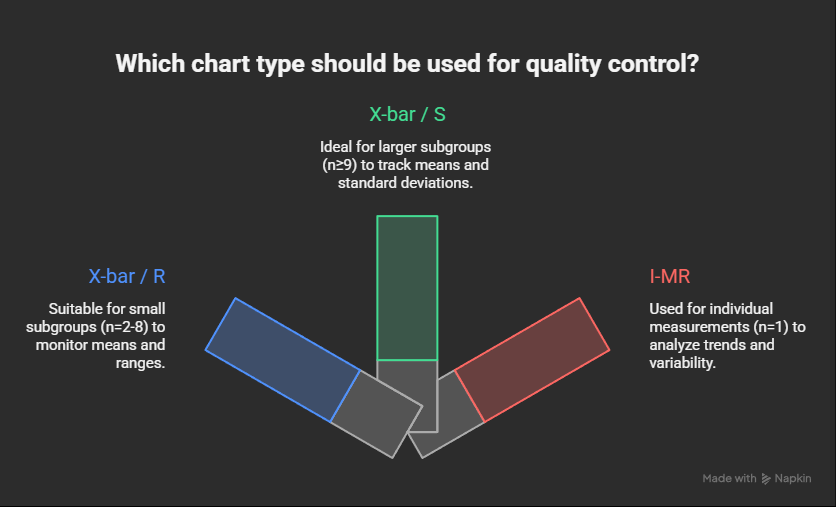

# SPC Control Chart Tool

A browser-based Statistical Process Control (SPC) tool built with Streamlit. Upload a CSV file, configure your analysis, and instantly generate control charts with full process capability reporting — no software installation required.

Supports X-bar/R, X-bar/S, and Individuals/Moving Range (I-MR) charts with automatic chart type selection, configurable spec limits, and one-click Excel export.

---

## Live App

**[https://spcanalysistool.streamlit.app](https://spcanalysistool.streamlit.app)**

Open in any browser — no Python, no Jupyter, no installation needed.

---

## Features

- **Three SPC chart types** — X-bar/R, X-bar/S, and I-MR; auto-selected based on subgroup size
- **Dual-panel chart** — X-bar (or Individuals) chart on top, R/S/MR companion chart below
- **Control limit zones** — green shading within control limits, yellow shading in warning zones
- **Capability indices** — Cp, Cpk (short-term) and Pp, Ppk (long-term) calculated automatically
- **Process statistics** — mean, short- and long-term sigma, min, max, and observation count
- **Configurable spec limits** — USL and LSL inputs with sensible defaults (mean ± 3σ)
- **Excel export** — formatted `.xlsx` report with embedded chart image and subgroup data table
- **Graceful error handling** — clear messages for malformed files, insufficient data, or invalid inputs

---

## Chart Types

| Chart | Description | Auto-selected when |
| --- | --- | --- |
| X-bar / R | Subgroup means and ranges | n = 2–8 |
| X-bar / S | Subgroup means and standard deviations | n ≥ 9 |
| I-MR | Individual values and moving ranges | Manual selection only |



---

## How to Use

1. **Open the app** at [https://spcanalysistool.streamlit.app](https://spcanalysistool.streamlit.app)
2. **Upload a CSV file** using the sidebar — comma, semicolon, and tab delimiters are supported
3. **Select the column** to analyze from the dropdown (numeric columns only)
4. **Set subgroup size** using the slider — chart type auto-selects based on n
5. **Adjust USL and LSL** if the defaults (mean ± 3σ) do not match your specification
6. The chart and statistics update instantly — **Download Excel Report** to save results

---

## App Output

### Capability Indices

| Metric | Description |
| --- | --- |
| **Cp** | Process capability — spread relative to tolerance (short-term sigma) |
| **Cpk** | Process capability accounting for mean centering (short-term sigma) |
| **Pp** | Process performance — spread relative to tolerance (long-term sigma) |
| **Ppk** | Process performance accounting for mean centering (long-term sigma) |

### Process Statistics

| Metric | Description |
| --- | --- |
| **Mean (X̄)** | Grand mean of all subgroup averages |
| **Sigma ST** | Short-term sigma estimated from within-subgroup variation |
| **Sigma LT** | Long-term sigma — overall standard deviation of all individual values |
| **Min / Max** | Minimum and maximum values in the dataset |
| **Observations** | Total number of data points used in the analysis |

### Control Chart

- Top panel: X-bar (or Individuals) chart with UCL, LCL, USL, LSL, and a stats annotation box
- Bottom panel: R, S, or MR companion chart with its own UCL and LCL

### Excel Export

The downloaded `.xlsx` report contains two sheets:

| Sheet | Contents |
| --- | --- |
| **SPC Report** | Stats summary table (chart type, control limits, spec limits, capability indices) + embedded chart image |
| **Data** | Per-subgroup X-bar and R/S/MR values |

---

## Local Development

### Requirements

```bash
pip install -r requirements.txt
```

| Package | Version | Purpose |
| --- | --- | --- |
| `streamlit` | ≥ 1.33.0 | Web app framework |
| `pandas` | ≥ 2.0.0 | CSV loading and data manipulation |
| `numpy` | ≥ 1.26.0 | Subgroup calculations and control limits |
| `matplotlib` | ≥ 3.8.0 | Chart rendering |
| `openpyxl` | ≥ 3.1.0 | Excel file export |
| `pytest` | ≥ 8.0.0 | Unit tests |

### Run locally

```bash
streamlit run app.py
```

### Run tests

```bash
pytest tests/test_spc_utils.py -v
```

### Deploy on Streamlit Cloud

1. Fork or push this repo to your GitHub account
2. Go to [share.streamlit.io](https://share.streamlit.io)
3. Connect your GitHub account and select this repository
4. Set **Main file path** to `app.py`
5. Click **Deploy** — the app is live instantly at a public URL

---

## File Structure

```text
spc-control-chart-tool/
├── app.py                      # Streamlit app — UI, chart rendering, Excel export
├── spc_utils.py                # SPC calculation logic — chart stats and capability indices
├── requirements.txt            # Python dependencies
├── spc_tool.ipynb              # Original Jupyter notebook version
├── sample_spc_report.xlsx      # Example Excel export output
├── .streamlit/
│   └── config.toml             # Streamlit theme configuration
├── tests/
│   └── test_spc_utils.py       # Unit tests for spc_utils (6 tests)
├── screenshots/
│   └── chart_type.png          # Chart type selection reference
└── docs/
    └── plans/                  # Implementation planning documents
```

---

## SPC Methodology

- **Short-term sigma (Cp/Cpk)** is estimated from within-subgroup variation using R-bar/d₂ (X-bar/R) or S-bar/c₄ (X-bar/S) — this reflects the process's inherent capability when operating in a stable state.
- **Long-term sigma (Pp/Ppk)** is the overall standard deviation of all individual measurements — this reflects actual process performance including shifts and drifts over time.
- **Subgroup truncation** — data is truncated to the nearest complete subgroup; incomplete trailing observations are excluded.
- **SPC constants** (A2, A3, D3, D4, B3, B4, d2, c4) are tabulated for subgroup sizes n = 2 through 25 per AIAG/Shewhart reference tables.

---

## Demo Dataset

The included demo uses the [UCI Wine dataset](https://archive.ics.uci.edu/dataset/109/wine) (178 observations, 13 chemical attributes). Replace with your own process or manufacturing data for real analysis.

---

## License

[MIT](LICENSE) — free to use, modify, and distribute.
